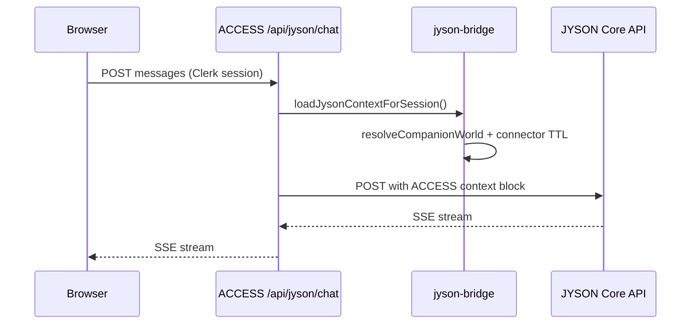
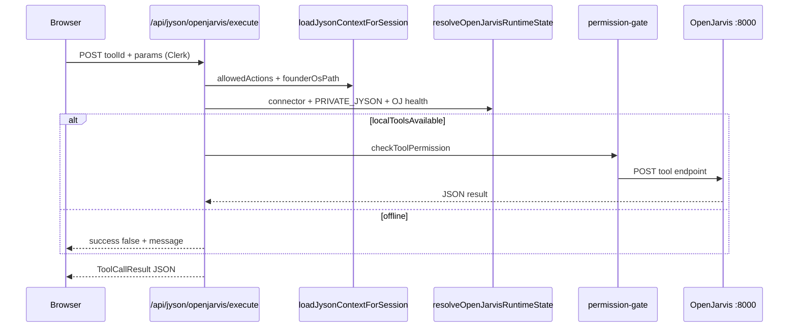

# ACCESS OS — Runtime Architecture

**Date:** 2026-06-02  
**Scope:** ACCESS Runtime, JYSON Runtime, OpenJarvis Adapter, Connector System, Command Center, execution flow  
**Status:** Phase 8 OpenJarvis integration committed — see `project_openjarvis_integration.md` for phase checklist  

This document describes the **current** architecture. It does not propose redesigns.

---

## 1. ACCESS Runtime

ACCESS OS is the **identity and permission plane** for the JD AI Systems platform.

| Responsibility | Location |
|----------------|----------|
| Authentication | Clerk (`proxy.ts`, `@clerk/nextjs/server`) |
| Identity + handle | `lib/actions/identity.ts`, `access_identities` (Supabase) |
| Founder blueprint | `lib/actions/founder-blueprint.ts`, `blueprints` |
| Handle context (orgs, products, experiences, actions) | `lib/access-handle/` |
| Agent policy (`allowedActions` / `deniedActions`) | `lib/access-handle/agent-policy.ts` |
| App shell + navigation | `components/navigation/`, `lib/navigation/` |
| Design system | `lib/design-system/` |

**Runtime outputs consumed by JYSON:**

- `JysonContext` — serializable world + permissions + `companionState`
- Loaded via `loadJysonContextForSession()` → `resolveCompanionWorld()` (signed-in path)
- Or `loadJysonContextFromAccessHandle(handle)` (handle/dev path)

**Cloud vs local:**

- **Vercel / production:** `PRIVATE_JYSON_ENABLED` is never true; no local tool execution.
- **Local dev:** `PRIVATE_JYSON_ENABLED=true` in `.env.local` enables the OpenJarvis layer when connector + OpenJarvis are online.

---

## 2. JYSON Runtime

JYSON is the **Value Architecture Engine** (personality + reasoning). ACCESS does not own JYSON inference; it **hosts the harness** that feeds context and routes commands.

| Layer | Location | Role |
|-------|----------|------|
| Runtime harness | `access-app/lib/jyson-bridge/` | Context load, companion diagnostics, dispatch bridge |
| Companion resolver | `resolve-companion-world.ts` | Cloud package → local Founder OS upgrade path |
| Chat proxy | `app/api/jyson/chat/route.ts` | Injects ACCESS context block → streams from JYSON Core API |
| Monorepo dispatch | `jyson-runtime/` (loaded via `jyson-runtime-loader.ts`) | Intent classify + route when package on disk |
| JYSON Core (hosted) | `jyson` app → `api/chat` | Models, DISCOVER → STRUCTURE personality |

**Companion state** (`companionState` on `JysonContext`):

- `cloudReady`, `localConnected`, `status`
- `connectorOnline` — from Supabase `connector_devices.last_seen_at` (90s TTL), not hardcoded

**Without OpenJarvis online:**

- `/api/jyson/chat` still works (blueprint context only).
- Cloud keyword dispatch fallback when local `jyson-runtime` modules unavailable.
- OpenJarvis tools return structured errors; chat does not crash.

---

## 3. OpenJarvis Adapter

OpenJarvis is the **local operational shell** — files, vault notes, email/calendar (gated), Ollama, browser. It does not replace JYSON personality.

| Artifact | Path |
|----------|------|
| Canonical bridge (JYSON repo) | `jyson/backend/openjarvis-bridge/` |
| ACCESS build copy (keep in sync) | `access-app/lib/openjarvis-bridge/` |
| Runtime resolver | `access-app/lib/openjarvis/resolve-runtime-state.ts` |
| Server actions | `access-app/lib/actions/openjarvis-tools.ts` |

**Permission gate** (every tool):

```
Tool request → checkToolPermission(allowedActions, connectorOnline, cloudMode)
            → optional user confirmation (mutating tools)
            → HTTP POST to OPENJARVIS_LOCAL_URL (default :8000)
```

**HTTP API (Clerk session required):**

| Route | Purpose |
|-------|---------|
| `GET /api/jyson/openjarvis/health` | Connector heartbeat + OpenJarvis `/health` |
| `GET /api/jyson/openjarvis/tools` | Registry + runtime flags |
| `POST /api/jyson/openjarvis/execute` | Gated tool execution |

**Safe default tool for E2E tests:** `read_file` or `list_files` (non-mutating, `read_vault_seeds` action).

---

## 4. Connector System

The ACCESS Connector is a **local CLI package** that registers the machine, sends heartbeats, and syncs Founder OS metadata to Supabase.

| Piece | Location |
|-------|----------|
| Package | `access-app/packages/access-connector/` |
| Online detection | `lib/connector/connector-online.ts` |
| Device rows | `connector_devices` (`identity_id`, `last_seen_at`, `status`) |
| Phase 4 APIs | JWT middleware, sync apply, RLS — `docs/PHASE_4_IMPLEMENTATION.md` |

**Heartbeat:**

```bash
cd access-app
npm run connector:heartbeat
```

**Online rule:** `last_seen_at` within **90 seconds** for the signed-in user’s `identity_id`.

**Isolation:** Heartbeat and device queries are scoped by Clerk user → `access_identities` → single identity’s devices. Connector JWT routes bind `identity_id` on the device row (Phase 4).

**Operator scripts:** `connector:register`, `connector:sync-apply`, `pairing:code`, etc. — see `package.json`.

---

## 5. Command Center

Command Center is the **platform nervous system** — health classification, probes, operator-facing status. It is shared across products (`access_os`, `jyson`, `build`, `vault`, `jd_ai_systems_core`).

| Piece | Location |
|-------|----------|
| Canonical doc (monorepo) | `JD_AI_SYSTEMS_COMMAND_CENTER_ARCHITECTURE.md` |
| M5 implementation blueprint | `access-app/docs/M5_COMMAND_CENTER_ARCHITECTURE.md` |
| Health engine (M4) | `access-app/lib/platform-health/` |
| Internal UI | `app/internal/command-center/` |
| Internal API | `app/api/internal/command-center/` |
| Status pages | `app/internal/status/` |

Command Center **observes** connector/platform health; OpenJarvis tool execution **uses** connector heartbeat via `connector-online.ts`, not via Command Center probes.

---

## 6. Current execution flow

### A. Signed-in companion chat (cloud-safe)



### B. Local OpenJarvis tool (Phase 8)



### C. Preconditions for local tools

All must be true:

1. `PRIVATE_JYSON_ENABLED=true` (local `.env.local`)
2. Recent connector heartbeat (`npm run connector:heartbeat` loop or cron)
3. OpenJarvis server running at `OPENJARVIS_LOCAL_URL` (default `http://localhost:8000`)
4. User signed in; tool’s `requiredAction` in `allowedActions`

---

## 7. Local OpenJarvis execution test (operator runbook)

**Goal:** Verify heartbeat, OpenJarvis health, tool registry, one safe tool E2E, result visible in ACCESS — without architecture changes.

### Prerequisites

| Requirement | Check |
|-------------|--------|
| Supabase env in `access-app/.env.local` | `NEXT_PUBLIC_SUPABASE_URL`, service role, Clerk keys |
| `PRIVATE_JYSON_ENABLED=true` | In `.env.local` only (never on Vercel) |
| `OPENJARVIS_LOCAL_URL=http://localhost:8000` | Optional if default |
| Founder OS package on disk | Companion diagnostic shows `local_founder_os_ready` or better |
| OpenJarvis installed and running | Separate process on port 8000 |

### Step 0 — Automated smoke (no live OpenJarvis required)

```bash
cd /Users/jdproductions/Documents/JD_Ai_System/access-app
npm run openjarvis:verify-phase8
npm run preflight && npm run registry:verify
```

Expect: `PHASE 8 VERIFICATION: PASS`.

### Step 1 — Start ACCESS (webpack if Turbopack fails)

```bash
cd /Users/jdproductions/Documents/JD_Ai_System/access-app
npx next dev --webpack -p 3000
```

Sign in at `http://localhost:3000` with your Clerk test user.

### Step 2 — Register connector (once per machine/user)

```bash
cd /Users/jdproductions/Documents/JD_Ai_System/access-app
npm run pairing:code          # if device not yet paired — follow CLI output
npm run connector:register    # if not registered
```

Ensure `packages/access-connector/.env` (or env) has Supabase + device credentials from pairing.

### Step 3 — Connector heartbeat (keep alive during test)

In a **dedicated terminal**, run heartbeat on an interval (every 30–60s is fine; TTL is 90s):

```bash
cd /Users/jdproductions/Documents/JD_Ai_System/access-app
npm run connector:heartbeat
```

Re-run every minute **or** use a loop:

```bash
while true; do npm run connector:heartbeat; sleep 45; done
```

### Step 4 — Start OpenJarvis

Start your local OpenJarvis server so `GET http://localhost:8000/health` returns success (exact response shape depends on your OpenJarvis install).

### Step 5 — Verify health API (signed-in browser)

Open `http://localhost:3000/companion`. Confirm diagnostics show connector online when heartbeat is fresh.

In DevTools → Console (while signed in):

```javascript
const health = await fetch('/api/jyson/openjarvis/health').then((r) => r.json());
console.log('OpenJarvis health', health);
```

**Pass criteria:**

- `connectorOnline: true`
- `openJarvisOnline: true` (when OpenJarvis is running)
- `localToolsAvailable: true`

### Step 6 — Verify tool registry

```javascript
const tools = await fetch('/api/jyson/openjarvis/tools').then((r) => r.json());
console.log('Tools', tools.tools?.length, tools.runtime);
```

**Pass criteria:** Non-empty `tools` array; `runtime.localToolsAvailable === true`.

### Step 7 — Execute one safe tool (`list_files`)

Use a **read-only** tool under your Founder OS root (adjust `directory` if needed):

```javascript
const result = await fetch('/api/jyson/openjarvis/execute', {
  method: 'POST',
  headers: { 'Content-Type': 'application/json' },
  body: JSON.stringify({
    toolId: 'list_files',
    params: { directory: '.' },
  }),
}).then((r) => r.json());
console.log('Tool result', result);
```

**Pass criteria:** `success: true` and `output` present (file list or OpenJarvis payload).

Alternative safe tool — read a known file:

```javascript
await fetch('/api/jyson/openjarvis/execute', {
  method: 'POST',
  headers: { 'Content-Type': 'application/json' },
  body: JSON.stringify({
    toolId: 'read_file',
    params: { path: 'manifest.json' },
  }),
}).then((r) => r.json());
```

### Step 8 — Return result through JYSON Runtime (ACCESS context path)

The harness path is: tool result → JSON API → operator (or future UI). To **surface output inside ACCESS** today without new UI:

1. Stay on `/companion`.
2. Open **JYSON Chat** panel.
3. Paste a one-line summary of the tool JSON into chat, **or** ask JYSON: “Summarize this local tool result:” and paste `result.output`.

The runtime chain for **chat** remains `/api/jyson/chat` (context includes `connectorOnline` from Step 5). Tool execution does not auto-inject into chat yet; Phase 8 wires APIs only.

**Confirm context carries connector flag:** On `/companion`, check world diagnostics and permissions panel — `connectorOnline` should match Step 5. Context is loaded via server action `fetchJysonCompanionContext()` (not a public REST route).

### Step 9 — Failure checklist

| Symptom | Likely fix |
|---------|------------|
| `connectorOnline: false` | Run `connector:heartbeat`; check device registered to same Clerk user |
| `openJarvisOnline: false` | Start OpenJarvis; check `OPENJARVIS_LOCAL_URL` |
| `localToolsAvailable: false` | Set `PRIVATE_JYSON_ENABLED=true` in `.env.local`; run `PRIVATE_JYSON_ENABLED=true npm run dev` (env prefix, not npm arg) |
| Gemini `404` / `gemini-1.5-flash is not found` | Update `GEMINI_MODEL=gemini-2.5-flash` on **jyson** Vercel (`jyson/api/chat.ts`); redeploy jyson.vercel.app |
| 401 on APIs | Sign in via Clerk |
| Permission denied | User type lacks `read_vault_seeds`; check `allowedActions` on companion panel |
| OpenJarvis 404 on tool | Endpoint mismatch — align `TOOL_ENDPOINTS` in `lib/openjarvis-bridge/adapter.ts` with OpenJarvis routes |

### Step 10 — Record result

Log in `project_openjarvis_integration.md` or operator notes:

- Timestamp, toolId, `success`, short output excerpt
- Readiness bump toward **85+** after live E2E pass

---

## Related documents

| Doc | Topic |
|-----|--------|
| `project_openjarvis_integration.md` | OpenJarvis phases 1–8 handoff |
| `jyson/backend/openjarvis-bridge/ARCHITECTURE.md` | Bridge boundary rules |
| `PHASE_4_IMPLEMENTATION.md` | Connector JWT + sync |
| `ACCESS_AGENT.md` | Verify scripts before ship |
| `JD_AI_SYSTEMS_COMMAND_CENTER_ARCHITECTURE.md` | Command Center (monorepo root) |

---

## Repository map

| Repo / path | Role |
|-------------|------|
| `access-app/` | ACCESS OS (this app) — **commit Phase 8 here** |
| `jyson/` | JYSON Core UI + canonical OpenJarvis bridge source |
| `jyson-runtime/` | Dispatch / classify (monorepo sibling) |
| `JD_Ai_System/` (root) | Vault, landing page, command_center file bridge |
