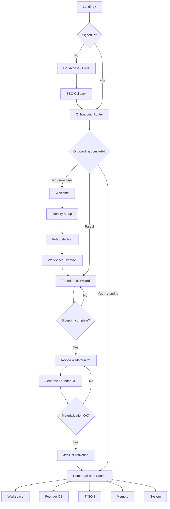
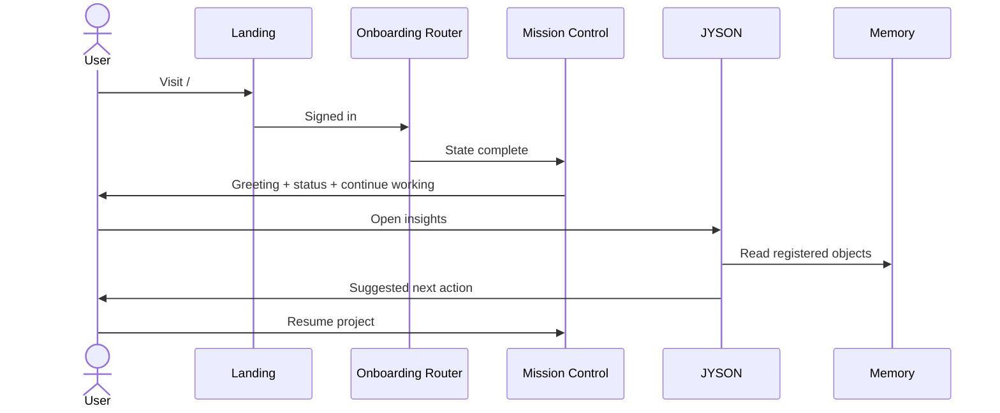
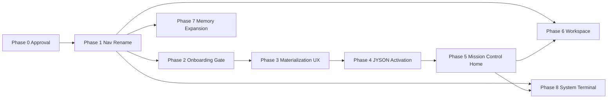

# ACCESS OS V2 — Architecture & Experience Report

**Author:** Principal Product Designer / Experience Architect  
**Date:** 2026-06-02  
**Status:** Design proposal — **DO NOT IMPLEMENT until approval**  
**Scope:** UX architecture, navigation, journeys, sitemap, wireframes, phased plan  
**Out of scope:** Brand tokens, theme, shell CSS, component library changes, Founder OS generation internals, JYSON companion runtime internals

---

## Executive Summary

ACCESS is positioned in product language as an **Operating System** — not a dashboard, CRM, or project manager. JYSON is an **AI Operator** embedded in that OS — not a chatbot page. Founder OS is the **blueprint + materialization centerpiece** that gives the OS its shape. Memory (conceptually renaming Registry) is the **persistent intelligence layer** that survives sessions.

The codebase today delivers strong individual modules (landing, Founder Blueprint wizard, JYSON Companion panel, Registry data layer) but **orchestrates them as disconnected destinations**. A signed-in user lands on `/` or `/dashboard` with no onboarding gate, no world-activation sequence, and no Mission Control home. JYSON frequently surfaces repair states because users arrive before Founder OS materialization completes.

V2 reframes navigation, post-auth routing, and Home into a **single activation journey** ending at Mission Control — without changing the locked visual system.

---

## 1. Current State Audit

### 1.1 Product framing vs. implementation

| Concept | Intended framing | Current implementation |
|---------|------------------|------------------------|
| ACCESS | Operating System | Labeled "Dashboard," "Terminal," module placeholders; feels like a nav hub |
| JYSON | AI Operator | Labeled "Companion"; standalone page at `/companion` with hash sections |
| Founder OS | Blueprint + materialization centerpiece | Labeled "Founder"; wizard at `/founder` with export/generate on Review step |
| Memory | Persistent intelligence layer | Labeled "Registry"; identity/object registry at `/registry` |
| Home | Mission Control | `/dashboard` and signed-in `/` render placeholder cards, not operational surface |

### 1.2 Route & shell inventory (as-built)

Source: `lib/navigation/config.ts`, `docs/access-navigation.md`, `app/**`

| Route | Auth | Shell | Primary component | Maturity |
|-------|------|-------|-------------------|----------|
| `/` | Public → signed-in flip | Landing OR `AccessOsShell` | `TerminalLanding` / `AccessOsShell` | Landing polished; signed-in = dashboard module |
| `/dashboard` | Signed-in | `AccessUniversalShell` via `AccessOsSignedInPage` | `AccessOsWorkspace` (dashboard) | **Placeholder** — 4 link cards |
| `/registry` | Signed-in | `AccessUniversalShell` + module rail | `RegistryModule` | **Functional** — only enabled OS module |
| `/founder` | Required | `AccessAppLayout` | `FounderBlueprintWizard` | **Functional** — multi-step wizard |
| `/companion` | Required | `AccessAppLayout` | `JysonCompanionPanel` | **Conditional** — repair panel or loaded world |
| `/settings` | Required | `AccessAppLayout` | `SettingsPageClient` | **Placeholder** — 3 operator link cards |
| `/internal/command-center` | Operator | `CommandCenterChrome` | Server-rendered health dashboard | **Functional** — platform ops |
| `/internal/status` | Operator | `CommandCenterChrome` | Internal status | Functional |
| `/status` | Public | — | Public status page | Functional |
| `/projects/[id]` | Signed-in | Legacy `AppSystemNav` | Builder project detail | **Orphan** — not in primary nav |
| `/sso-callback` | Clerk | — | OAuth callback | Infrastructure |

### 1.3 Navigation system (as-built)

**Primary nav** (`PRIMARY_NAV` in `lib/navigation/config.ts`):

```
Dashboard  → /dashboard
Terminal   → /
Founder    → /founder
Companion  → /companion
Registry   → /registry
Settings   → /settings
```

**Context nav** appears for Founder (`?step=`), Companion (`#hash`), and Settings (operator links).

**Shell split:**
- `AccessUniversalShell` — dashboard, registry (OS modules)
- `AccessAppLayout` — founder, companion, settings, command center

**Brand mark in rail** links to `/dashboard`, not `/` (`AccessNavRail.tsx`).

### 1.4 Post-authentication behavior (as-built)

```tsx
// app/page.tsx — signed-in path
{isLoaded && isSignedIn && <AccessOsShell initialModule="dashboard" />}
```

- Sign-in from landing returns to `/` (or deep link target via `?redirect=founder|companion`).
- `PostLoginRedirect.tsx` exists and handles `?redirect=` for founder/companion only — **not wired into `page.tsx` today**.
- `LandingWithRedirect.tsx` exists as an alternate landing wrapper — **not used by `page.tsx`**.
- **No onboarding gate:** no check for identity handle, blueprint completeness, Founder OS package, or JYSON activation state before showing dashboard.
- **No Welcome, Role Selection, or Workspace Creation screens exist.**

### 1.5 Founder OS flow (as-built)

`FounderBlueprintWizard.tsx` steps: Identity (handle) → Companies → Products → Experiences → Review.

Review step actions:
- **Save** — persists blueprint to ACCESS
- **Export & Generate Founder OS** — exports YAML, downloads file, calls `generateFounderOsFromBlueprint()`
- On success: manual CTA **"Open JYSON Companion →"** linking to `/companion`

Gaps vs. product intent:
- Language mixes "Export" and "Generate" — user sees export/download before materialization completes.
- No auto-transition to JYSON activation after materialization.
- Wizard is discoverable only if user navigates to Founder — not part of mandatory first-run path.
- Identity step lives inside Founder wizard, not a global onboarding identity gate.

### 1.6 JYSON / Companion (as-built)

`JysonCompanionPanel.tsx`:
- Loads context via `fetchJysonCompanionContext()`
- When world not ready: `JysonCompanionRepairPanel` with diagnostics ("Your ACCESS world is not ready yet")
- When loaded: `CompanionLoadedView` with greeting, hybrid cloud/local badges, identity summary, permissions
- Context nav sections: Overview, Memory, Projects, Agents, Diagnostics (hash-based)
- Eyebrow copy: **"JYSON · COMPANION"** — positions as page, not operator

Companion memory section (`#memory`) shows identity summary inline — overlaps conceptually with Registry but is read-only context inside Companion.

### 1.7 Registry / Memory layer (as-built)

`AccessOsWorkspace.tsx` + `RegistryModule`:
- Registry is the only **enabled** module in `OS_MODULES` (`components/os/types.ts`); systems, agents, projects, blueprints, etc. are disabled ("Soon").
- Dashboard module is a static grid linking to Registry, Founder, Companion, Command Center.
- Registry loads identity handle + registered objects via `useRegistryData`.

### 1.8 Dashboard / Home (as-built)

```tsx
// AccessOsWorkspace.tsx — dashboard module
<h1>Dashboard</h1>
<p>Your operating surface. Open Registry, Founder, or Companion from the navigation rail.</p>
// 4 placeholder stat cards → /registry, /founder, /companion, /internal/command-center
```

No greeting, no system status aggregation, no Continue Working, no JYSON Insights feed.

### 1.9 Operator / System surfaces (as-built)

- Command Center: full platform health dashboard (`app/internal/command-center/page.tsx`)
- Settings context nav nests Command Center, Platform Status, Public Status
- Terminal demo mode on landing (`TerminalLanding.tsx`) — read-only CLI preview, not signed-in developer terminal

### 1.10 Technical assets ready for V2 (no rework needed)

- Clerk auth + identity actions (`getOrCreateIdentity`)
- Founder blueprint CRUD + validation
- Founder OS generation action (`generateFounderOsFromBlueprint`)
- JYSON context bridge + repair actions
- Registry data layer + summary types
- Universal shell + nav rail architecture (config-driven)
- Breadcrumb + context nav resolution (`resolve-nav.ts`)

---

## 2. UX Problems

### P1 — Category collapse: OS reads as app suite

Six peer nav items (Dashboard, Terminal, Founder, Companion, Registry, Settings) present ACCESS as a **collection of pages**, not a layered OS with Home → Workspace → Intelligence → System. Users must know which module to open; nothing tells them **where they are in the lifecycle**.

### P2 — Broken first-run journey

```
Today:    Landing → Sign In → Dashboard (empty)
Required: Landing → Sign In → Welcome → … → Mission Control
```

Signed-in `/` immediately renders dashboard placeholders. Identity, blueprint, Founder OS, and JYSON activation are **optional side quests**, not the boot sequence.

### P3 — JYSON arrives before the world exists

Companion repair panel is the default for users who sign in and click Companion without completing Founder OS materialization. The product **punishes exploration** instead of **guiding activation**.

### P4 — Founder OS materialization is buried and mislabeled

"Export & Generate Founder OS" conflates file export (developer artifact) with materialization (OS birth moment). Download YAML is correct for power users but wrong as the **primary first-run CTA language**.

### P5 — Memory / Registry / Companion memory fragmentation

Three overlapping concepts:
- **Registry** — registered objects, identity layer (nav primary)
- **Companion #memory** — identity summary snippet
- **No unified "Memory"** as persistent intelligence the user understands

Users cannot answer: *Where does ACCESS remember me?*

### P6 — Terminal identity crisis

`/` is simultaneously:
- Public landing (unsigned)
- Signed-in Terminal nav target (same URL)
- Dashboard competitor (signed-in shows `AccessOsShell`, not terminal UI)

Nav label "Terminal" does not match signed-in experience.

### P7 — Home is not Mission Control

Dashboard lacks operational density: no cross-subsystem status, no resume affordance, no JYSON feed. Power users bounce between 4–5 nav items to understand system state.

### P8 — Orphan routes break wayfinding

`/projects/[id]` uses legacy `AppSystemNav`, disconnected from `AccessNavRail`. Breadcrumbs root to `/dashboard` but projects are unreachable from primary nav.

### P9 — Post-login redirect infrastructure unused

`PostLoginRedirect.tsx` and `LandingWithRedirect.tsx` exist but are not integrated into the main page flow; redirect map covers only `founder` and `companion`, not a unified onboarding router.

### P10 — Every screen fails the three-question test

Design philosophy: **What is this? Why am I here? What next?**

| Screen | What is this? | Why am I here? | What next? |
|--------|---------------|----------------|------------|
| Dashboard | Unclear — "operating surface" | Because I signed in | Pick a card manually |
| Founder Review | Blueprint review | If I found Founder | Export or open Companion |
| Companion (repair) | Error/recovery | I clicked Companion too early | Repair steps (technical) |
| Registry | Identity layer | I know what Registry means | Browse objects |

---

## 3. Navigation Audit

### 3.1 Primary nav — current vs. proposed

| Current | Path | Issue | V2 | Path |
|---------|------|-------|-----|------|
| Dashboard | `/dashboard` | Wrong metaphor; placeholder | **Home** | `/home` (or `/` signed-in) |
| Terminal | `/` | Collides with landing | *(moved)* | **System → Developer Tools → Terminal** |
| Founder | `/founder` | Undersells Founder OS | **Founder OS** | `/founder-os` |
| Companion | `/companion` | Chatbot framing | **JYSON** | `/jyson` |
| Registry | `/registry` | Technical label | **Memory** | `/memory` |
| Settings | `/settings` | Too generic for OS | **System** | `/system` |
| — | — | Missing | **Workspace** | `/workspace` |

### 3.2 Context nav — current vs. proposed

**Founder OS** — retain wizard steps as context (rename labels only):
- Identity → Companies → Products → Experiences → Review & Materialize

**JYSON** — reframe sections as operator panels:
- Overview → Insights → Actions → Projects → Diagnostics

**Memory** — absorb registry module rail:
- All → Systems → Agents → Projects → Blueprints → Connections *(enable progressively)*

**Workspace** — new context:
- Overview → Projects → Systems → Members → Settings

**System** — absorb settings + operator tools:
- General → Account → Developer Tools (Terminal) → Command Center → Platform Status

### 3.3 Breadcrumb root

Current: `ACCESS → Dashboard` (href `/dashboard`)  
Proposed: `ACCESS → Home` (href `/home`)

### 3.4 Nav rail brand mark

Current: links to `/dashboard`  
Proposed: links to `/home` (Mission Control)

### 3.5 Route aliasing strategy (implementation note)

Preserve existing URLs with redirects during migration:
- `/dashboard` → `/home`
- `/companion` → `/jyson`
- `/registry` → `/memory`
- `/founder` → `/founder-os`
- `/settings` → `/system`

---

## 4. User Journey Audit

### 4.1 Current journeys

**Journey A — Default sign-in (most common)**
```
Landing (/) → Get Access → Clerk → / (signed-in) → Dashboard placeholders
```
Outcome: Empty world. User must self-discover Founder, Registry, Companion.

**Journey B — Deep link to Founder**
```
/founder → redirect /?redirect=founder → sign in → /founder → wizard steps → Export & Generate → manual "Open Companion"
```
Outcome: Functional but opt-in. No workspace or role context.

**Journey C — Deep link to Companion**
```
/companion → sign in → repair panel (if no package)
```
Outcome: Failure-first experience.

**Journey D — Operator**
```
/settings → Command Center / Status
```
Outcome: Works for platform operators; unrelated to founder journey.

### 4.2 Required future journey (V2)

```
┌─────────┐    ┌─────────┐    ┌─────────┐    ┌──────────────────┐
│ Landing │───▶│ Sign In │───▶│ Welcome │───▶│ Identity Setup   │
└─────────┘    └─────────┘    └─────────┘    └────────┬─────────┘
                                                        │
                        ┌───────────────────────────────┘
                        ▼
              ┌──────────────────┐    ┌───────────────────────┐
              │ Role Selection   │───▶│ Workspace Creation    │
              └────────┬─────────┘    └───────────┬───────────┘
                       │                            │
                       └────────────┬───────────────┘
                                    ▼
                        ┌───────────────────────┐
                        │ Founder OS Creation   │
                        │ (blueprint wizard)    │
                        └───────────┬───────────┘
                                    ▼
                        ┌───────────────────────┐
                        │ Founder OS            │
                        │ Materialization       │
                        │ "Generate Founder OS" │
                        └───────────┬───────────┘
                                    │ auto
                                    ▼
                        ┌───────────────────────┐
                        │ JYSON Activation      │
                        │ (operator comes online)│
                        └───────────┬───────────┘
                                    ▼
                        ┌───────────────────────┐
                        │ ACCESS Home           │
                        │ (Mission Control)     │
                        └───────────────────────┘
```

### 4.3 Journey stage definitions

| Stage | What is this? | Why am I here? | What next? |
|-------|---------------|----------------|------------|
| **Welcome** | ACCESS OS introduction | You signed in for the first time (or new workspace) | Begin setup |
| **Identity Setup** | Claim `handle.access` | Your OS needs a persistent identity separate from login | Confirm handle + display name |
| **Role Selection** | How you operate | ACCESS adapts workspace defaults to founder / operator / team | Select role → prefill workspace |
| **Workspace Creation** | Your operating environment | Every OS instance needs a workspace boundary | Name workspace, confirm |
| **Founder OS Creation** | Blueprint composition | Materialization requires a canonical blueprint | Complete wizard steps |
| **Materialization** | OS birth moment | Blueprint becomes runnable Founder OS package | Generate → progress → success |
| **JYSON Activation** | Operator online | JYSON requires materialized package to load world | Auto brief activation UI → confirm |
| **Home** | Mission Control | Your OS is live; resume work here | Continue Working / JYSON Insights |

### 4.4 Returning user journey

```
Sign In → Onboarding Router (checks state) → Home (Mission Control)
                │
                ├─ incomplete blueprint → resume Founder OS step
                ├─ blueprint but no package → Materialization
                ├─ package but JYSON inactive → Activation
                └─ fully active → Home
```

### 4.5 Journey vs. codebase mapping

| Stage | Exists today? | Location |
|-------|---------------|----------|
| Landing | ✅ | `TerminalLanding.tsx` |
| Sign In | ✅ | Clerk |
| Welcome | ❌ | — |
| Identity Setup | ⚠️ partial | Founder wizard `handle` step only |
| Role Selection | ❌ | — |
| Workspace Creation | ❌ | — |
| Founder OS Creation | ✅ | `FounderBlueprintWizard` |
| Materialization | ⚠️ partial | Review step; wrong CTA framing; no auto-progress |
| JYSON Activation | ❌ | Manual link to `/companion` |
| Home / Mission Control | ❌ | Dashboard placeholder |

---

## 5. Screen Inventory

### 5.1 Public / auth

| Screen | Route | Status | V2 action |
|--------|-------|--------|-----------|
| Landing | `/` | Keep | Minor copy alignment; stays pre-auth only |
| SSO Callback | `/sso-callback` | Keep | No change |
| Public Status | `/status` | Keep | Link from System |

### 5.2 Onboarding (new)

| Screen | Route | Status | V2 action |
|--------|-------|--------|-----------|
| Welcome | `/onboarding/welcome` | **New** | First-run intro |
| Identity Setup | `/onboarding/identity` | **New** | Extract/refactor from Founder handle step |
| Role Selection | `/onboarding/role` | **New** | Founder / Operator / Team |
| Workspace Creation | `/onboarding/workspace` | **New** | Name + confirm workspace |
| Onboarding Router | `/onboarding` or middleware | **New** | State machine gate |

### 5.3 Core OS (reframed)

| Screen | Current route | V2 route | Status | V2 action |
|--------|---------------|----------|--------|-----------|
| Home (Mission Control) | `/dashboard`, signed-in `/` | `/home` | Placeholder | **Build** — see §8 |
| Workspace | — | `/workspace` | Missing | **New** — projects/systems hub |
| Founder OS | `/founder` | `/founder-os` | Functional | Rename + onboarding integration |
| JYSON | `/companion` | `/jyson` | Conditional | Rename + activation screen |
| Memory | `/registry` | `/memory` | Functional | Rename; enable module rail over time |
| System | `/settings` | `/system` | Placeholder | Expand; nest Terminal + operator tools |

### 5.4 Founder OS sub-screens (existing wizard)

| Step | Query | Status |
|------|-------|--------|
| Identity | `?step=handle` | ✅ |
| Companies | `?step=organizations` | ✅ |
| Products | `?step=products` | ✅ |
| Experiences | `?step=experiences` | ✅ |
| Review & Materialize | `?step=review` | ✅ (relabel CTA) |

### 5.5 JYSON sub-screens

| Section | Hash | Status | V2 |
|---------|------|--------|-----|
| Overview | `#overview` | ✅ | Keep |
| Memory snippet | `#memory` | ✅ | De-emphasize; link to Memory nav |
| Projects | `#projects` | ✅ | Keep |
| Agents | `#agents` | ✅ | Rename → Actions |
| Diagnostics | `#diagnostics` | ✅ | Keep |
| Activation | — | ❌ | **New** — post-materialization interstitial |

### 5.6 Memory sub-screens (registry modules)

| Module | Enabled | V2 |
|--------|---------|-----|
| Registry (All) | ✅ | Memory → All |
| Systems | ❌ Soon | Enable when data ready |
| Agents | ❌ Soon | Enable |
| Projects | ❌ Soon | Enable |
| Blueprints | ❌ Soon | Enable |
| Assets, Workflows, Vaults, Connections, Offers | ❌ Soon | Phased |

### 5.7 System / operator

| Screen | Route | Status |
|--------|-------|--------|
| System General | `/system` | Placeholder |
| Developer Terminal | `/system/terminal` | **New** — relocate demo/CLI |
| Command Center | `/internal/command-center` | Functional |
| Internal Status | `/internal/status` | Functional |

### 5.8 Legacy / orphan

| Screen | Route | V2 action |
|--------|-------|-----------|
| Builder Project | `/projects/[id]` | Integrate under Workspace → Projects |
| Signed-in `/` dashboard | `/` | Split: landing only public; signed-in → router |

---

## 6. Updated Sitemap

```
access.app
│
├── /                          PUBLIC — Landing (signed-out only)
├── /sso-callback              AUTH
├── /status                    PUBLIC — Platform status
│
├── /onboarding                ONBOARDING GATE
│   ├── /welcome
│   ├── /identity
│   ├── /role
│   └── /workspace
│
├── /home                      HOME — Mission Control ★ default signed-in
│
├── /workspace                 WORKSPACE
│   ├── /                      overview
│   ├── /projects
│   ├── /projects/[id]         ← migrated from orphan route
│   ├── /systems
│   └── /members
│
├── /founder-os                FOUNDER OS
│   └── ?step=handle|organizations|products|experiences|review
│
├── /jyson                     JYSON OPERATOR
│   ├── /                      overview (default)
│   ├── /activate              post-materialization (new)
│   └── #overview|insights|actions|projects|diagnostics
│
├── /memory                    MEMORY (was Registry)
│   └── module rail: all|systems|agents|projects|blueprints|…
│
├── /system                    SYSTEM (was Settings)
│   ├── /                      general
│   ├── /account
│   ├── /terminal              developer terminal
│   ├── /internal/command-center   (operator)
│   └── /internal/status           (operator)
│
└── [redirects]
    /dashboard  → /home
    /founder    → /founder-os
    /companion  → /jyson
    /registry   → /memory
    /settings   → /system
```

---

## 7. Navigation Hierarchy

### 7.1 Primary rail (signed-in)

```
◈ ACCESS
─────────────
Navigate
  ▣  Home              /home
  ▤  Workspace         /workspace
  ◫  Founder OS        /founder-os
  ◎  JYSON             /jyson
  ◇  Memory            /memory
  ⚙  System            /system
```

### 7.2 Contextual sections (secondary rail)

**Home** — no context nav (single surface)

**Workspace**
- Overview · Projects · Systems · Members

**Founder OS**
- Identity · Companies · Products · Experiences · Review

**JYSON**
- Overview · Insights · Actions · Projects · Diagnostics

**Memory**
- All · Systems · Agents · Projects · Blueprints · Connections

**System**
- General · Account · Developer Tools · Command Center · Status

### 7.3 Developer Tools nesting

Terminal moves under System to resolve landing/`/` collision:

```
System
  └── Developer Tools
        └── Terminal        /system/terminal
```

Landing demo terminal (`TerminalLanding` demo mode) becomes the public preview; signed-in Terminal is the authenticated developer surface.

### 7.4 Information architecture principles

1. **Home is default** — every signed-in session roots at Mission Control unless onboarding incomplete.
2. **JYSON is peer, not child** — operator sits alongside Founder OS and Memory, not nested under Home.
3. **Memory is noun, JYSON Insights is verb** — Memory stores; JYSON surfaces and acts.
4. **Workspace is where work lives** — projects and systems are operational, not registry metadata.
5. **System is infrastructure** — settings, terminal, operator tools do not compete with daily nav.

### 7.5 Breadcrumb examples

```
ACCESS → Home
ACCESS → Founder OS → Identity
ACCESS → JYSON → Insights
ACCESS → Memory → Blueprints
ACCESS → System → Developer Tools → Terminal
ACCESS → Workspace → Projects → [Project Name]
```

---

## 8. Wireframe Proposal

### 8.1 Landing `/` (signed out)

```
┌────────────────────────────────────────────────────────────┐
│                    JD AI SYSTEMS                           │
│                                                            │
│                      A C C E S S                           │
│              Create your ACCESS identity.                  │
│                                                            │
│              [ ◈  Get Access ]                             │
│              continue with Google / GitHub / Apple         │
│                                                            │
│   Your login → verifies you                                │
│   Your ACCESS ID → identifies you                          │
│                                                            │
│              → Explore the terminal first                  │
└────────────────────────────────────────────────────────────┘
```
*Existing `TerminalLanding` — minimal V2 copy pass only.*

---

### 8.2 Welcome `/onboarding/welcome`

```
┌─ ACCESS ───────────────────────────────────────────────────┐
│ ░░░░░░░░░░░░░░░░░░░░░░░░░░░░░░░░░░░░░░░░░░░░░░░░░░░░░░░░ │
│                                                            │
│   WELCOME TO ACCESS                                        │
│   You're building an operating system for how you          │
│   create, remember, and operate.                           │
│                                                            │
│   In the next few minutes you'll:                          │
│     1. Claim your identity                                 │
│     2. Choose how you operate                              │
│     3. Create your workspace                               │
│     4. Materialize your Founder OS                         │
│     5. Activate JYSON                                      │
│                                                            │
│                              [ Begin Setup → ]             │
│                                                            │
└────────────────────────────────────────────────────────────┘
```

---

### 8.3 Identity Setup `/onboarding/identity`

```
┌─ ACCESS → Setup ───────────────────────────────────────────┐
│ Step 1 of 5 · Identity                                     │
│                                                            │
│   YOUR ACCESS ID                                           │
│   This is how the system knows you — across tools,         │
│   sessions, and intelligence layers.                       │
│                                                            │
│   Display name    [ Jerry Devin          ]                 │
│   Handle          [ jdwhite              ].access          │
│                                                            │
│   ✓ Available                                              │
│                                                            │
│                              [ Continue → ]                │
└────────────────────────────────────────────────────────────┘
```

---

### 8.4 Role Selection `/onboarding/role`

```
┌─ ACCESS → Setup ───────────────────────────────────────────┐
│ Step 2 of 5 · Role                                         │
│                                                            │
│   HOW DO YOU OPERATE?                                      │
│                                                            │
│   ┌─────────────┐  ┌─────────────┐  ┌─────────────┐       │
│   │  FOUNDER    │  │  OPERATOR   │  │    TEAM     │       │
│   │  Build and  │  │  Run systems│  │  Collaborate│       │
│   │  materialize│  │  and infra  │  │  in shared  │       │
│   │  your OS    │  │             │  │  workspace  │       │
│   └─────────────┘  └─────────────┘  └─────────────┘       │
│                                                            │
│                              [ Continue → ]                │
└────────────────────────────────────────────────────────────┘
```

---

### 8.5 Workspace Creation `/onboarding/workspace`

```
┌─ ACCESS → Setup ───────────────────────────────────────────┐
│ Step 3 of 5 · Workspace                                    │
│                                                            │
│   NAME YOUR WORKSPACE                                      │
│   Everything you build lives here.                         │
│                                                            │
│   Workspace name  [ JD Productions        ]                │
│   Handle          jdwhite.access (linked)                  │
│                                                            │
│                              [ Create Workspace → ]        │
└────────────────────────────────────────────────────────────┘
```

---

### 8.6 Founder OS Creation `/founder-os` (existing wizard, reframed header)

```
┌─ ACCESS ───────────────────────────────────────────────────┐
│ ◈ ACCESS │ Navigate │ Section: Identity                    │
├──────────┴─────────────────────────────────────────────────┤
│ Founder OS · Step 1 — Identity                             │
│                                                            │
│   Claim and confirm your founder identity.                 │
│   [ wizard fields — existing FounderBlueprintWizard ]      │
│                                                            │
│   [ ← Back ]                              [ Continue → ]   │
└────────────────────────────────────────────────────────────┘
```

---

### 8.7 Materialization `/founder-os?step=review`

```
┌─ ACCESS → Founder OS → Review ─────────────────────────────┐
│                                                            │
│   REVIEW & MATERIALIZE                                     │
│   Your blueprint becomes a live Founder OS package.        │
│                                                            │
│   ┌────────────────────────────────────────────────────┐   │
│   │ { blueprint preview JSON / summary }               │   │
│   └────────────────────────────────────────────────────┘   │
│                                                            │
│   [ Save Draft ]     [ ◈ Generate Founder OS ]             │
│                                                            │
│   ── on success ──                                         │
│   ✓ Founder OS materialized                                │
│   Activating JYSON…                                        │
└────────────────────────────────────────────────────────────┘
```
*CTA rename: "Export & Generate Founder OS" → "Generate Founder OS". YAML download moves to secondary/advanced action.*

---

### 8.8 JYSON Activation `/jyson/activate`

```
┌─ ACCESS ───────────────────────────────────────────────────┐
│                                                            │
│   JYSON ACTIVATION                                         │
│   Your AI operator is coming online.                       │
│                                                            │
│   [████████████░░░░] Materialization verified              │
│   [████████████████] Memory linked                       │
│   [████████░░░░░░░░] Operator initializing…                │
│                                                            │
│   JYSON will read your Founder OS, connect to Memory,      │
│   and begin operating inside your workspace.               │
│                                                            │
│                    ( auto-continues to Home )              │
└────────────────────────────────────────────────────────────┘
```

---

### 8.9 Home — Mission Control `/home` ★

```
┌─ ACCESS ───────────────────────────────────────────────────┐
│ ◈ ACCESS │ Home                          jdwhite.access  ◉ │
├──────────┴─────────────────────────────────────────────────┤
│                                                            │
│   Good morning, Jerry.                                     │
│   Your operating system is live.                           │
│                                                            │
│   ┌─ SYSTEM STATUS ─────────────────────────────────────┐  │
│   │ ACCESS        ● Operational                         │  │
│   │ Founder OS    ● Materialized · v2026.06.02          │  │
│   │ JYSON         ● Active · cloud + local sync         │  │
│   │ Memory        ● 12 registered objects               │  │
│   │ Projects      ● 3 active                            │  │
│   └─────────────────────────────────────────────────────┘  │
│                                                            │
│   ┌─ CONTINUE WORKING ────────┐ ┌─ JYSON INSIGHTS ───────┐ │
│   │ → Bridge Video pilot      │ │ • Blueprint drift: none│ │
│   │ → LILDEV Season 1 roster  │ │ • 2 products unlinked  │ │
│   │ → ACCESS nav v2 spec      │ │ • Suggested: review    │ │
│   │                           │ │   experiences step     │ │
│   │ [ View all projects ]     │ │ [ Open JYSON → ]       │ │
│   └───────────────────────────┘ └────────────────────────┘ │
│                                                            │
│   ┌─ QUICK ACTIONS ─────────────────────────────────────┐  │
│   │ [ Founder OS ]  [ Memory ]  [ Workspace ]  [ JYSON]│  │
│   └─────────────────────────────────────────────────────┘  │
│                                                            │
└────────────────────────────────────────────────────────────┘
```

**Data sources (orchestration layer — no new backend required for v1 Home):**
- Greeting: Clerk user + time of day
- Status row: registry summary + JYSON companion state + blueprint/export flags
- Continue Working: recent builder projects + last visited founder step
- JYSON Insights: companion context summary + diagnostic recommendations (read-only)

---

### 8.10 JYSON Operator `/jyson` (loaded state)

```
┌─ ACCESS ───────────────────────────────────────────────────┐
│ ◈ │ Navigate │ Section: Overview                           │
├───┴────────────────────────────────────────────────────────┤
│ JYSON · AI Operator                                        │
│                                                            │
│   Hello Jerry. Your ACCESS world is loaded.                │
│   ◈ Cloud ready   ◉ Local sync pending                     │
│                                                            │
│   ┌─ INSIGHTS ──────────────┐ ┌─ ALLOWED ACTIONS ────────┐ │
│   │ System headline…        │ │ ✓ List products          │ │
│   │ Identity summary…       │ │ ✓ Update blueprint       │ │
│   └─────────────────────────┘ │ ✗ Restricted actions…    │ │
│                               └──────────────────────────┘ │
│   [ JYSON Command Layer — existing component ]             │
└────────────────────────────────────────────────────────────┘
```

---

### 8.11 Memory `/memory`

```
┌─ ACCESS ───────────────────────────────────────────────────┐
│ ◈ │ Navigate │ Memory: All │ [module rail]                 │
├───┴────────────────────────────────────────────────────────┤
│ Memory · Persistent intelligence                           │
│ jdwhite.access · 12 registered objects                     │
│                                                            │
│   [ Registry table / object list — existing RegistryModule]│
│   [ Context panel — existing AccessOsContextPanel ]        │
└────────────────────────────────────────────────────────────┘
```

---

### 8.12 System `/system`

```
┌─ ACCESS ───────────────────────────────────────────────────┐
│ ◈ │ Navigate │ Section: General                            │
├───┴────────────────────────────────────────────────────────┤
│ System                                                     │
│ Infrastructure, account, and developer tools.              │
│                                                            │
│   ┌──────────────┐ ┌──────────────┐ ┌──────────────┐      │
│   │  Terminal    │ │ Command Ctr  │ │ Platform     │      │
│   │  Developer   │ │ Operator     │ │ Status       │      │
│   └──────────────┘ └──────────────┘ └──────────────┘      │
└────────────────────────────────────────────────────────────┘
```

---

## 9. User Flow Diagram

### 9.1 First-run activation (required journey)



### 9.2 Onboarding router decision logic

```mermaid
flowchart LR
    subgraph inputs [State checks]
        I1[Has handle?]
        I2[Has workspace?]
        I3[Blueprint complete?]
        I4[Founder OS package?]
        I5[JYSON active?]
    end

    subgraph routes [Route to]
        R1[/onboarding/welcome]
        R2[/onboarding/identity]
        R3[/onboarding/workspace]
        R4[/founder-os]
        R5[/founder-os?step=review]
        R6[/jyson/activate]
        R7[/home]
    end

    I1 -->|no| R2
    I2 -->|no| R3
    I3 -->|no| R4
    I4 -->|no| R5
    I5 -->|no| R6
    I5 -->|yes| R7
```

### 9.3 Daily return flow



---

## 10. Implementation Plan

> **DO NOT IMPLEMENT until approval.**
>
> All phases are **orchestration / UX layer changes** unless noted. Forbidden in early phases: Founder OS generation algorithm changes, JYSON companion runtime internals, brand tokens, theme, shell CSS, component library.

---

### Phase 0 — Approval gate

**Deliverable:** Signed approval on this document  
**Dependencies:** None  
**Output:** Greenlight for Phase 1

---

### Phase 1 — Navigation rename & route aliases

**Goal:** Product language matches OS framing without breaking bookmarks.

| Task | Files / area |
|------|----------------|
| Update `PRIMARY_NAV` labels and hrefs | `lib/navigation/config.ts` |
| Add route redirects | `next.config` or middleware |
| Update `resolvePrimaryNavId`, breadcrumbs | `lib/navigation/resolve-nav.ts`, `breadcrumbs.ts` |
| Update docs | `docs/access-navigation.md` |
| Nav rail brand → `/home` | `AccessNavRail.tsx` |

**Renames:**
- Dashboard → Home (`/home`)
- Founder → Founder OS (`/founder-os`)
- Companion → JYSON (`/jyson`)
- Registry → Memory (`/memory`)
- Settings → System (`/system`)
- Remove Terminal from primary nav; plan `/system/terminal`

**Explicitly NOT in Phase 1:**
- Founder OS generation logic
- JYSON runtime / repair internals
- Visual system changes

**Dependencies:** Phase 0 approval  
**Verification:** All old URLs redirect; nav labels correct; breadcrumbs match

---

### Phase 2 — Onboarding gate & router

**Goal:** No signed-in user reaches Home with an empty world.

| Task | Description |
|------|-------------|
| Create onboarding state machine | Check handle, workspace record, blueprint completeness, package existence, JYSON load state |
| Build `/onboarding/*` screens | Welcome, Identity, Role, Workspace — shell-only layouts using existing design system |
| Wire `PostLoginRedirect` / router | Replace signed-in `/` → dashboard with router → onboarding or home |
| Extract identity step | Share logic with Founder wizard handle step (orchestration only) |
| Integrate `LandingWithRedirect` | Consolidate redirect handling |

**Dependencies:** Phase 1 (routes stable)  
**Explicitly NOT in Phase 2:**
- New identity backend — use existing `getOrCreateIdentity`
- Workspace DB schema changes beyond minimal flag if needed

**Verification:** New user cannot reach `/home` until activation path defined; returning incomplete user resumes correct step

---

### Phase 3 — Founder OS materialization UX

**Goal:** Materialization is the centerpiece moment, not an export side effect.

| Task | Description |
|------|-------------|
| Relabel Review CTA | "Generate Founder OS" primary; YAML download secondary/advanced |
| Post-generate auto-route | On success → `/jyson/activate` (not manual Companion link) |
| Progress interstitial | Materialization progress UI on Review step |
| Onboarding handoff | Steps 4–5 of onboarding flow into Founder wizard |

**Dependencies:** Phase 2 router (knows when to send user to review)  
**Explicitly NOT in Phase 3:**
- Changes to `generateFounderOsFromBlueprint` internals
- Changes to `exportFounderBlueprintYaml` validation rules

**Verification:** First-run user flows Welcome → … → Generate → JYSON activate without manual nav

---

### Phase 4 — JYSON activation screen

**Goal:** JYSON comes online as operator activation, not error recovery.

| Task | Description |
|------|-------------|
| Build `/jyson/activate` | Progress UI; calls existing context load / repair actions |
| Auto-continue to Home | On successful context load |
| Reframe Companion copy | "JYSON · AI Operator" eyebrows; section rename Insights/Actions |
| Repair panel as fallback | Only when activation fails mid-flow — not first Companion visit |

**Dependencies:** Phase 3 materialization success signal  
**Explicitly NOT in Phase 4:**
- JYSON bridge protocol changes
- New agent capabilities

**Verification:** Post-materialization user sees activation → Home; JYSON context loaded

---

### Phase 5 — Home / Mission Control

**Goal:** Home answers What is this? Why am I here? What next?

| Task | Description |
|------|-------------|
| Replace dashboard placeholder | `AccessOsWorkspace` dashboard module → Mission Control layout |
| System status row | Compose from registry summary + JYSON state + blueprint flags |
| Continue Working | Recent projects (builder actions) + last founder step |
| JYSON Insights feed | Read-only slice of companion context / diagnostics |
| Default signed-in route | `/home` via router |

**Dependencies:** Phases 1–4 (status signals meaningful)  
**Data sources:** Existing APIs only — orchestration composition

**Verification:** Returning active user lands on Home with populated status, projects, insights

---

### Phase 6 — Workspace & orphan integration

**Goal:** Projects live under Workspace, not orphan routes.

| Task | Description |
|------|-------------|
| Create `/workspace` overview | Projects list + systems summary |
| Migrate `/projects/[id]` | Under workspace shell + universal nav |
| Retire `AppSystemNav` on project page | Use `AccessAppLayout` |

**Dependencies:** Phase 1 nav, Phase 5 Home (Continue Working links)  
**Verification:** Project reachable from Workspace and Home; consistent nav

---

### Phase 7 — Memory module expansion

**Goal:** Memory rail modules enable progressively as data exists.

| Task | Description |
|------|-------------|
| Rename registry copy → Memory | UI strings only |
| Enable OS modules incrementally | `OS_MODULES` enabled flags |
| Cross-link JYSON ↔ Memory | JYSON insights link to Memory objects |

**Dependencies:** Phase 1 rename, registry data layer  
**Explicitly NOT in Phase 7:** New registry schema

---

### Phase 8 — System / Terminal relocation

**Goal:** Resolve `/` landing vs Terminal collision.

| Task | Description |
|------|-------------|
| `/system/terminal` | Authenticated developer terminal surface |
| Public `/` landing only | Signed-in `/` → router (not shell) |
| Demo terminal | Stays on landing as preview |

**Dependencies:** Phase 1 System nav  
**Verification:** No signed-in user sees dashboard at `/`; Terminal accessible under System

---

### Phase dependency graph



---

## Appendix A — File reference map (audit sources)

| File | Relevance |
|------|-----------|
| `lib/navigation/config.ts` | Primary + context nav definitions |
| `lib/navigation/resolve-nav.ts` | Route → nav ID resolution |
| `lib/navigation/breadcrumbs.ts` | Breadcrumb trail builder |
| `docs/access-navigation.md` | Current nav documentation |
| `app/page.tsx` | Landing / signed-in shell switch |
| `app/dashboard/page.tsx` | Dashboard route |
| `components/os/AccessOsWorkspace.tsx` | Dashboard + Registry workspace |
| `components/os/AccessOsShell.tsx` | OS shell composition |
| `components/founder/FounderBlueprintWizard.tsx` | Founder OS wizard + materialization |
| `components/jyson/JysonCompanionPanel.tsx` | JYSON operator surface |
| `components/access/PostLoginRedirect.tsx` | Partial redirect handler (unused in page) |
| `components/access/LandingWithRedirect.tsx` | Landing redirect wrapper (unused in page) |
| `components/navigation/AccessNavRail.tsx` | Nav rail + brand link |
| `app/internal/command-center/page.tsx` | Operator Command Center |

---

## Appendix B — Glossary (V2 product language)

| Term | Definition |
|------|------------|
| **ACCESS** | The operating system — identity, workspace, memory, and operator layer |
| **Founder OS** | Materialized package from canonical blueprint; the OS instance blueprint |
| **JYSON** | AI Operator — reads Founder OS + Memory, surfaces insights, executes allowed actions |
| **Memory** | Persistent intelligence layer — registered objects, identity artifacts, system memory |
| **Workspace** | Operational boundary — where projects and systems run |
| **Home / Mission Control** | Default signed-in surface — status, resume, insights |
| **System** | Infrastructure — account, developer tools, operator dashboards |
| **Materialization** | Blueprint → live Founder OS package (not "export") |
| **Activation** | JYSON operator coming online against materialized package |

---

**END OF REPORT**

**DO NOT IMPLEMENT until approval.**

Upon approval, begin with **Phase 1 (Navigation rename & route aliases)** — lowest risk, highest clarity gain — followed by **Phase 2 (Onboarding gate)**, which unblocks all downstream activation UX.
