# M6 — Platform Deployment & Multi-Product Architecture

**Milestone:** M6 (Architecture only — no production code in this document)  
**Prerequisite:** M4 (connector/sync/registry), M5 (command center — in progress; **do not modify** M5 implementation areas when executing M6 code later)  
**Source of truth for IDs:** [`JD_AI_SYSTEMS_CANONICAL_REGISTRY.md`](../../JD_AI_SYSTEMS_CANONICAL_REGISTRY.md) (repo root)

---

## Executive summary

M6 defines how **five canonical products** (ACCESS OS, JYSON, Build, Vault, JD AI Systems Core) share **one platform layer** (auth, health, status, command center) while retaining **independent deployments** and **selective database isolation** — scalable to **50+ products** without registry drift or phantom product IDs.

**Out of scope for M6 implementation touch:** `lib/platform-health/`, command-center runtime, provider probes, incident engine, status/alert infrastructure (owned by M5).

---

## 1. Product map

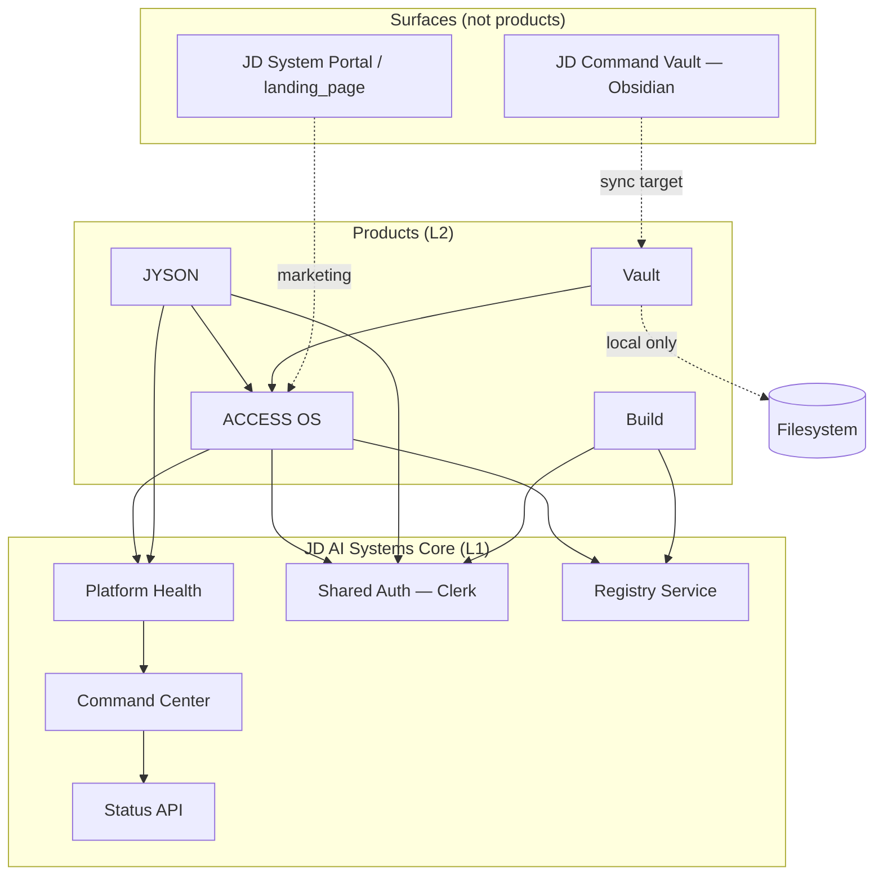

| Product | Primary user | Value | Deploy unit |
|---------|--------------|-------|-------------|
| **ACCESS OS** | Founder / operator | Handle, registry, connector, Founder OS, internal APIs | `access-app` (Next.js) |
| **JYSON** | Founder + future consumer | Companion, dispatch, ACCESS context bridge | `jyson/` (Vite) |
| **Build** | Operator / client delivery | Builder projects, offers, pipelines | Future `build-app` or ACCESS routes |
| **Vault** | Operator | Local knowledge + vault scan source | No cloud deploy — connector reads disk |
| **JD AI Systems Core** | Engineering | Health, status, incidents, shared packages | Extracted npm packages + APIs on ACCESS host until split |

---

## 2. Dependency map

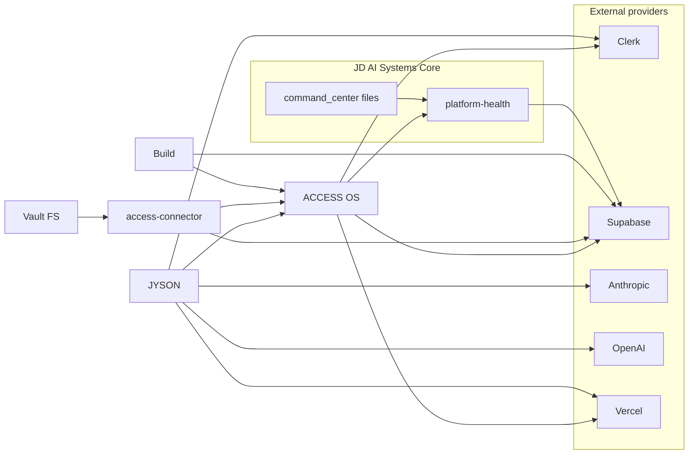

**Hard rules**

| Dependent | May not depend on |
|-----------|-------------------|
| Vault (local) | Vercel runtime for reads |
| JYSON | Direct Supabase service role (use ACCESS APIs) |
| Build | JYSON UI |
| Any product | Unregistered product_id (see canonical registry) |
| Consumer surfaces | Engineering-only incident APIs |

---

## 3. Service map

| Layer | Service | Host today | M6 target host |
|-------|---------|------------|----------------|
| L1 | Platform Health | `access-app/lib/platform-health` | `@jd/platform-health` package |
| L1 | Command Center API | M5 → `access-app/app/api/platform/*` | Same + optional `platform.jd.ai` subdomain |
| L1 | Status (public) | M5 | Edge-cached route on ACCESS or dedicated status project |
| L1 | Registry | Supabase + `lib/access-handle` | `@jd/registry-client` |
| L1 | Sync | `lib/sync`, worker scripts | `@jd/sync-engine` + queue worker |
| L1 | Connector | `packages/access-connector` | Published CLI + device JWT |
| L2 | Founder OS | `lib/founder-os` | ACCESS OS module |
| L2 | JYSON bridge | `lib/jyson-bridge` | `@jd/jyson-bridge` |
| L2 | Vault scan | connector + registry | Unchanged local |
| L3 | Build | DB tables + future UI | Separate Vercel project when UI ships |

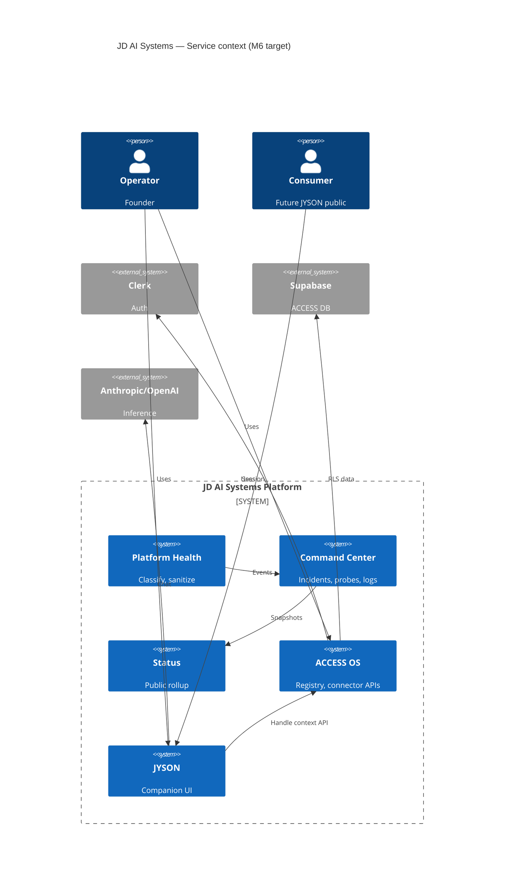

---

## 4. Infrastructure map

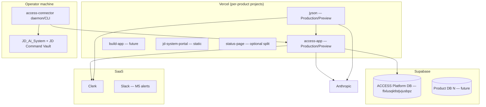

| Tier | Component | Isolation model |
|------|-----------|-----------------|
| Edge | Vercel middleware, cron, edge config | Per **Vercel project** |
| Compute | Next.js / Vite serverless | Per product deploy |
| Data | Postgres (Supabase) | **One platform DB** now; **new project per product** when RLS/scale requires |
| Identity | Clerk | **One Clerk application**; orgs/roles map to products |
| Secrets | Vercel env + Supabase vault | Scoped by `product_id` prefix |
| Local | Vault filesystem | Never replicated to cloud wholesale |

---

## 5. Data flow map

### 5.1 Registry & sync (M4 — foundation for M6)

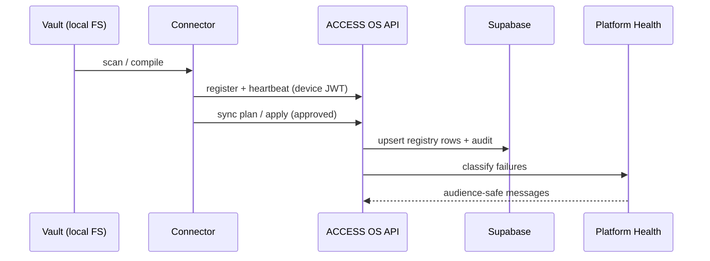

### 5.2 JYSON ↔ ACCESS

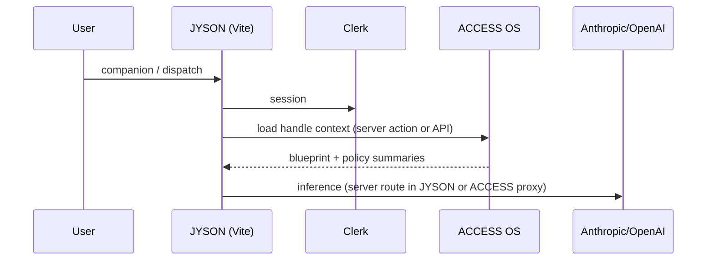

### 5.3 Platform observability (M5 — read-only for M6 design)

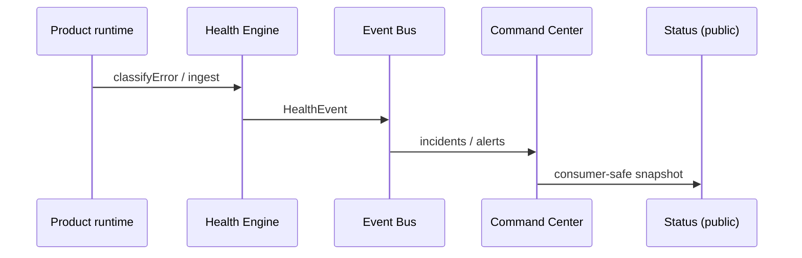

**Data classification**

| Class | Storage | Examples |
|-------|---------|----------|
| P0 Platform | ACCESS Supabase | identities, systems, sync_jobs |
| P1 Product config | Same DB or product DB | builder_projects |
| P2 Vault content | Local only | Obsidian markdown, exports |
| P3 Telemetry | `platform_logs`, snapshots | M5 tables |
| P4 Public status | Denormalized snapshot | No stack traces |

---

## 6. Authentication map

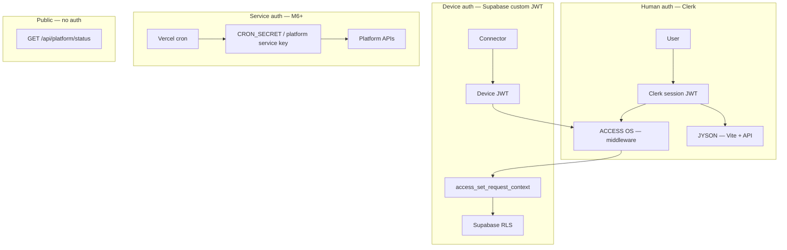

| Actor | Mechanism | Scope |
|-------|-----------|-------|
| Operator (human) | Clerk JWT | ACCESS, JYSON, future Build |
| Connector (device) | Device JWT + pairing | Sync apply, heartbeat |
| Platform cron | Shared secret header | Probes, snapshot build |
| Consumer | None | Status page only |
| Cross-product API | **M6:** OAuth-style platform token or Clerk M2M | JYSON → ACCESS context |

**Clerk strategy (shared auth)**

- Single Clerk application for JD AI Systems
- **Organizations** optional per client; default single founder org
- **Roles:** `founder`, `operator`, `engineering`, `consumer` (future)
- **JWT claims:** `access_handle`, `identity_id` (custom session claims via Clerk)
- JYSON and ACCESS share session where same domain cookie is impractical → **token handoff via ACCESS API** (already partially implemented in jyson-bridge)

**Supabase strategy**

- Human: Clerk → Supabase third-party auth (or custom JWT template)
- Device: `schema_v4_m2_tenant_jwt` path — connector identity in RLS
- **Never** expose service role to browser clients

---

## 7. Deployment map

### 7.1 Target topology (50+ products)

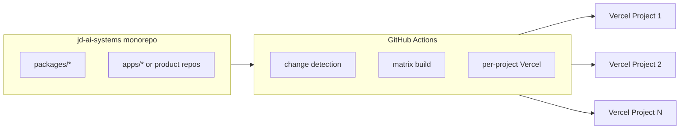

| Product | Repo layout | Vercel project | Branch → env |
|---------|-------------|----------------|--------------|
| ACCESS OS | `access-app/` (nested git) | `access-app` | `main` → production; PR → preview |
| JYSON | `jyson/` (nested git) | `jyson` | same |
| Build | `apps/build` (future) | `jd-build` | same |
| JD System portal | `landing_page/` | `jd-system` | same |
| Status only | optional | `jd-status` | production only |
| Core packages | monorepo | no deploy | publish to npm/GitHub packages |

### 7.2 Environment strategy

| Environment | Purpose | Data | URL pattern |
|-------------|---------|------|-------------|
| **development** | Local | Local vault + dev Supabase branch (recommended) | `localhost:*` |
| **preview** | PR / feature | Supabase **branch** or isolated preview project | `*.vercel.app` |
| **staging** | Pre-prod gate | Clone of prod schema; anonymized | `staging.*.jd.ai` (future) |
| **production** | Live | Primary Supabase project | canonical domains |

**Rules**

- Preview must **never** point connector at production vault write paths without explicit flag
- One Supabase **project** for platform until row count / compliance forces split
- Use Supabase **branching** for migration CI (M6 operational requirement)

### 7.3 Vercel strategy

| Concern | Approach |
|---------|----------|
| Multi-product | **One Vercel team, N projects** — not one mega-project |
| Shared code | npm workspaces / `@jd/*` packages versioned in monorepo |
| Env vars | Prefix: `ACCESS_*`, `JYSON_*`, `PLATFORM_*`; document in registry |
| Cron | Platform crons only on ACCESS (or dedicated `platform-worker` project) |
| Edge | Status page + public health on edge; engineering APIs on Node |
| Domains | `app.*` ACCESS, `jyson.*` JYSON, `status.*` public (optional split) |

### 7.4 Supabase strategy

| Phase | Model |
|-------|--------|
| **Now (M4–M5)** | Single ACCESS platform project — all registry, sync, platform tables |
| **M6** | Document **schema namespaces** (`platform_*`, `access_*`, `build_*`) in one DB |
| **Scale** | New Supabase project when: legal isolation, >50GB hot data, or independent backup SLA |
| **Per-product DB trigger** | Dedicated compliance, third-party tenant, or 10M+ rows in one product schema |

**Migration contract**

- All SQL in `access-app/supabase/` with `APPLY_ORDER.md`
- No ad-hoc dashboard edits without mirrored migration file
- Registry RPCs versioned (`get_registry_summary_v2` pattern)

### 7.5 Package strategy

```
packages/
  @jd/platform-health      # classify, types (from lib/platform-health)
  @jd/registry-client      # Supabase RPC + types
  @jd/sync-engine          # apply engine (server-only)
  @jd/jyson-bridge         # context builders (shared ACCESS + JYSON)
  @jd/canonical-registry   # generated constants from JD_AI_SYSTEMS_CANONICAL_REGISTRY.md
  access-connector           # existing CLI
apps/   (future)
  access-app/              # or keep nested git with workspace link
  jyson/
  build/
```

**Boundary rules**

| Package | May import | Must not import |
|---------|------------|-----------------|
| `@jd/platform-health` | nothing product-specific | ACCESS UI, JYSON UI |
| `@jd/jyson-bridge` | registry types | Supabase service role in browser bundle |
| `access-app` | all `@jd/*` | `jyson` src directly (use APIs) |
| `jyson` | `@jd/jyson-bridge` | `lib/sync` server secrets |

**Registry drift prevention**

- CI step: `npm run registry:verify` — unregistered `product:` literals and deprecated path patterns (`access app/`)
- `product_id` enum generated from registry markdown at build time (M6.1 implementation task)

### 7.6 CI/CD strategy

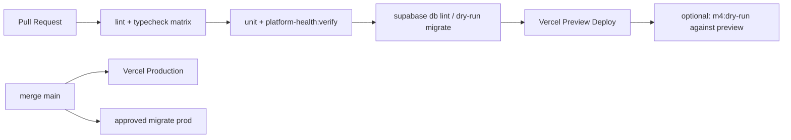

| Gate | Command / action | Blocks |
|------|------------------|--------|
| Structure | `npm run access:preflight` | wrong paths |
| Health classifier | `npm run platform-health:verify` | M4 regression |
| Platform M0 | `npm run platform:verify-m0` | Supabase drift |
| Connector | `npm run m4:dry-run` | sync safety |
| Registry drift | `scripts/verify-canonical-registry.ts` (M6) | forbidden product IDs |
| Build | `npm run build` (access-app) | ship break |

**Monorepo note:** `access-app` and `jyson` are **separate git remotes** today — CI should use path filters or separate workflows per repo with shared registry file synced on release tags.

### 7.7 Monitoring strategy

| Signal | Tool | Owner |
|--------|------|-------|
| App errors | Vercel logs + optional Sentry (M6+) | per product |
| Platform incidents | M5 Command Center | Core |
| Public status | M5 Status API | Core |
| DB performance | Supabase dashboard + advisors | Core |
| Connector heartbeats | `connector_devices` + alerts | ACCESS |
| Uptime | Vercel + external ping on `/api/platform/status` | Core |
| Cost | Vercel / Supabase / Clerk dashboards | operator |

**Do not duplicate M5:** M6 adds **deployment SLOs** and **registry CI**; probing stays in M5.

---

## 8. M6 architecture — what to build (phased)

### Phase M6.0 — Governance (no runtime change)

- [x] `JD_AI_SYSTEMS_CANONICAL_REGISTRY.md`
- [x] CI: `npm run registry:verify` (`scripts/verify-canonical-registry.ts`)
- [x] Link registry from `AGENT_BOOT.md` / `access-app/ACCESS_AGENT.md`

### Phase M6.1 — Package extraction (non-breaking)

- Extract `@jd/platform-health` types + classifier (copy, re-export from `access-app`)
- Add `@jd/canonical-registry` constants generated from registry MD
- JYSON consumes constants package only — no string literals for product names

### Phase M6.2 — Deployment hardening

- Supabase branching for preview
- Document env matrix per Vercel project
- Optional `status.jd.ai` Vercel project reading snapshot table only

### Phase M6.3 — Multi-DB readiness

- Schema prefixes + `product_id` column on all platform tables
- Migration playbook for splitting `build_*` to new Supabase project

### Phase M6.4 — 50+ product scale

- Self-serve **product onboarding** API: register `product_id` only if present in canonical registry (server-enforced)
- Per-product Vercel project template (Terraform or Vercel API script)
- Sharded health event ingestion (partition by `product_id`)

---

## 9. Database requirements (M6)

*Additive to M4/M5 — implement via migrations, not ad-hoc.*

| Table / object | Purpose |
|----------------|---------|
| `platform_products` | Mirror of canonical registry (optional cache; source remains git MD until sync automation) |
| `platform_environments` | `development|preview|staging|production` per deploy |
| `platform_deployments` | Last deploy SHA, Vercel project id, product_id |
| `platform_schema_migrations` | Applied migration audit (complement Supabase history) |
| Extend `platform_health_events` | Enforce FK or check constraint on `product_id` ∈ registry |
| RLS policies | Engineering role reads all; consumer reads status views only |

**Retention**

- Health events: 90d hot, archive to cold storage (M6.4)
- Sync audit: 1y minimum for rollback forensics

---

## 10. API requirements (M6)

*New routes — separate from M5 engineering routes where noted.*

| Method | Path | Auth | Purpose |
|--------|------|------|---------|
| GET | `/api/platform/registry/products` | engineering | List canonical products + lifecycle |
| GET | `/api/platform/deployments` | engineering | Deploy matrix |
| POST | `/api/platform/deployments/heartbeat` | service key | CI post-deploy hook |
| GET | `/api/v1/products/:id/health` | product token | Per-product slice (future) |
| GET | `/api/v1/products/:id/status` | public | Consumer status for one product |

**Versioning:** `/api/platform/*` = internal; `/api/v1/*` = stable cross-product contract.

**JYSON-specific (existing, document in OpenAPI M6):**

- Handle context load (server actions today → formal REST for third-party clients later)

---

## 11. Future package boundaries (summary)

| Boundary | Interface |
|----------|-----------|
| Vault ↔ Cloud | Connector scan manifest only — no bulk upload |
| JYSON ↔ ACCESS | HTTP + typed `@jd/jyson-bridge` |
| Build ↔ Registry | Supabase RPC + RLS scoped to `builder_projects` |
| Products ↔ Core | Health ingest + status read — no direct DB for satellite products |
| Core ↔ Providers | Adapter interface in M5 — registry lists provider_id only |

---

## 12. Deployment strategy (long-term)

1. **Registry-first:** No new Vercel project without row in `JD_AI_SYSTEMS_CANONICAL_REGISTRY.md`.
2. **Shared brain, separate ships:** Core packages versioned; apps pin semver.
3. **One auth plane:** Clerk + device JWT — no per-product auth silos.
4. **One health plane:** All products report `product_id` validated against registry.
5. **Independent databases by exception:** Default shared platform DB; split on trigger list (§7.4).
6. **Independent Vercel by default:** Every customer-facing product = own project for blast-radius and env isolation.
7. **Cinematic portal stays separate:** Not ACCESS OS — avoids marketing deploy breaking app.

---

## 13. Diagram — full platform (M6 target state)

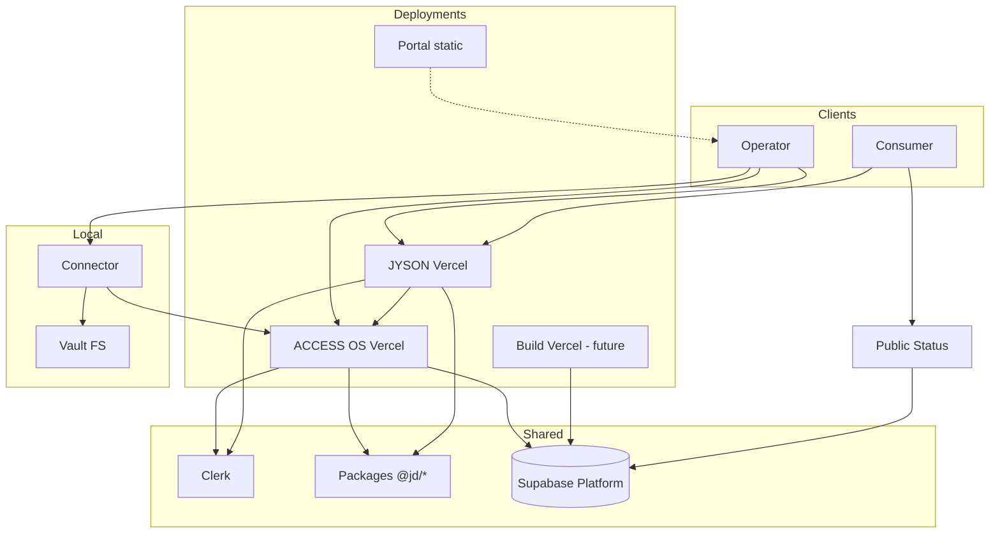

---

## 14. Risks & mitigations

| Risk | Mitigation |
|------|------------|
| Phantom product IDs | Canonical registry + `registry:verify` |
| Monorepo / multi-git confusion | `ACCESS_WORKSPACE.md` + preflight |
| M5/M6 collision | M6 doc only touches deployment; M5 owns probes/alerts |
| Service role leakage | Packages marked `server-only`; lint rule |
| Preview corrupting prod vault | `SYNC_ALLOW_APPLY=false` on preview |
| 50+ products in one DB | Partitioning + eventual per-product Supabase |

---

## 15. References

| Document | Path |
|----------|------|
| Canonical registry | `/JD_AI_SYSTEMS_CANONICAL_REGISTRY.md` |
| M5 Command Center | `M5_COMMAND_CENTER_ARCHITECTURE.md` |
| Health architecture | `JD_AI_SYSTEMS_HEALTH_ARCHITECTURE.md` |
| Ecosystem | `/ECOSYSTEM_ARCHITECTURE.md` |
| AI system | `/AI_SYSTEM_ARCHITECTURE.md` |
| ACCESS workspace | `/ACCESS_WORKSPACE.md` |
| Supabase apply order | `/access-app/supabase/APPLY_ORDER.md` |

---

*M6 architecture complete — implementation tracked in M6.0–M6.4 phases above. No production code in this milestone document.*
